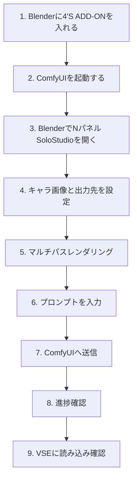
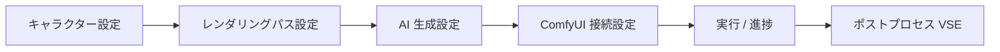

# 4'S ADD-ON 超初心者マニュアル（Blenderしかない人向け）

このマニュアルは、**プログラミング不要**で「Blender + ComfyUI + 4'S ADD-ON」を最初から動かすための手順書です。  
目的は、**Blender内でAI生成を実行し、結果を確認すること**です。

---

## 0. まず全体像（図解）



**迷ったらこの順番に戻ってください。**

---

## 1. 事前準備（最小）

- Blender 4.0以上
- このリポジトリ一式（`4-S-ADD-ON`）
- インターネット接続（ComfyUI初回セットアップ時）

---

## 2. Blenderへアドオンを導入

### 2-1. 自動導入（おすすめ）

1. ターミナル（またはPowerShell）を開く
2. このリポジトリのフォルダへ移動
3. 次を実行

```bash
python install_blender_addons.py --blender-version 4.0
```

### 2-2. Blenderで有効化

1. Blender起動
2. **編集 → プリファレンス → アドオン**
3. 検索欄に `SoloStudio` と入力
4. `SoloStudio Director` をON

### 2-3. 完了確認

- 3Dビューで `N` キーを押す
- 右サイドバーに **SoloStudio** タブが表示されればOK

---

## 3. ComfyUIをセットアップして起動

> ここは「ComfyUIがまだ無い人」向けです。

### 3-1. ComfyUIを入手

- ComfyUI公式リポジトリからダウンロード/クローン
- 展開（解凍）して任意フォルダに置く

### 3-2. 起動

- Windows（NVIDIA環境の例）: `run_nvidia_gpu.bat`
- それ以外の環境: ComfyUIドキュメント手順で `python main.py`

### 3-3. 起動確認

ブラウザで以下を開く:

- `http://127.0.0.1:8188`

開ければOKです。

---

## 4. Blender側の初期設定（迷わない順）

SoloStudioタブのパネル構成（図）:



### 4-1. ComfyUI接続設定

- **ComfyUI 接続設定**
  - ホスト: `127.0.0.1`
  - ポート: `8188`

### 4-2. キャラクター設定（推奨）

- **キャラクター設定**で `char_ref.png` を指定
- 未設定でも動作は可能だが、見た目の再現性は下がります

### 4-3. レンダリングパス設定

- 出力ディレクトリを指定（例: `//solo_studio_passes/`）
- Depth / Lineart / Normal / Mask / Base Color をON（初回は全部ON推奨）

---

## 5. 実際に1本生成する（デモ手順）

### 5-1. パスを出力

1. **レンダリングパス設定**パネル
2. **マルチパスレンダリング**を押す
3. 完了メッセージが出るまで待つ

完了目安:
- 出力フォルダ配下に `depth`, `lineart`, `normal`, `mask`, `base_color` が生成

### 5-2. AI生成設定を入力

**AI 生成設定**で以下を入れる（初回サンプル）:

- Positive: `anime style, cinematic background, detailed lighting`
- Negative: `lowres, blurry, bad anatomy`
- Steps: `20`
- CFG: `7`
- Seed: `-1`（毎回ランダム）

### 5-3. ComfyUIへ送信

1. **実行 / 進捗**パネル
2. **▶ ComfyUI へ送信**を押す
3. ステータスと進捗バーを確認

### 5-4. 完了後の確認

- 自動インポートONなら、VSEに生成結果が入る
- 入らない場合は **ポストプロセス (VSE)** から手動インポート

---

## 6. バッチ生成（複数フレーム）

1. **バッチ処理 (フレームシーケンス生成)** を開く
2. 開始/終了フレームを指定（例: 1〜24）
3. 出力先を指定
4. **▶ バッチ処理開始**
5. 完了後、VSEへ順次配置される

---

## 7. エラー時の最短チェック表

| 症状 | まず確認する場所 | 対処 |
|---|---|---|
| ComfyUI送信失敗 | ComfyUI接続設定 | `127.0.0.1:8188` とComfyUI起動状態を確認 |
| 進捗が止まる | 実行/進捗 | ComfyUI側キュー確認、必要ならComfyUI再起動 |
| 画像が出ない | レンダリングパス設定 | 出力先フォルダ権限、各パスONを確認 |
| キャラが安定しない | キャラクター設定 | `char_ref.png` を設定し直す |
| VSEに出ない | ポストプロセス | 自動インポートON、または手動インポート |

---

## 8. 「ここまでできれば成功」チェックリスト

- [ ] SoloStudioタブが見える
- [ ] ComfyUIの `http://127.0.0.1:8188` が開く
- [ ] マルチパスレンダリングが完了する
- [ ] 「▶ ComfyUI へ送信」で進捗バーが動く
- [ ] 生成結果をVSEで確認できる

すべてチェックできれば、**Blender内AI生成の基本導線は完了**です。
