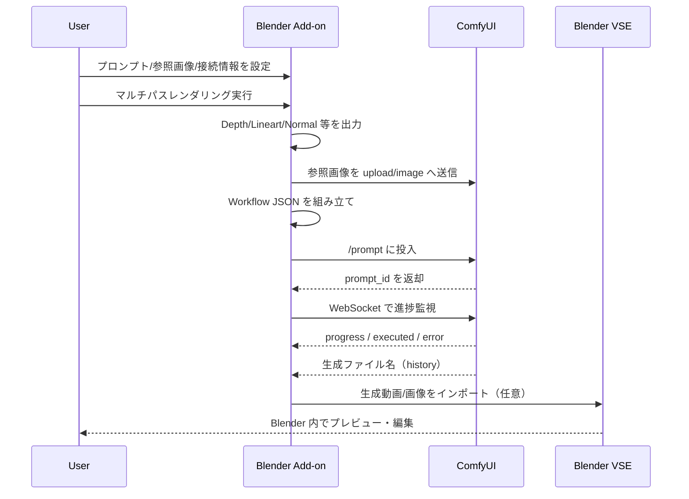

# 4’S (SoloStudioSystemS - Force) ADD-ON

Blender とローカル AI（ComfyUI）を連携し、**少人数・個人でもアニメーション制作を完走しやすくする**ための制作支援アドオンです。  
本プロダクトは、制作工程のうち **背景描写・コンポジション領域を AI で支援**し、クリエイターは **カメラワーク・モーション演出**に集中できるワークフローを提供します。

---

## 1. プロダクト概要

- **システム名**: 4’S (SoloStudioSystemS - Force) ADD-ON
- **主な対象**: 個人クリエイター、少人数制作チーム、映像・アニメーション制作学習者
- **主な価値**:
  - Blender 内で「素材抽出 → AI生成 → プレビュー」までを一気通貫
  - ComfyUI ワークフローをアドオン側で吸収し、複雑設定を最小化
  - 非同期進捗管理で、生成中も Blender 操作を継続しやすい

---

## 2. システム構造（構成図）

```mermaid
flowchart LR
    A[Blender / 4'S ADD-ON UI\nNパネル: SoloStudio] --> B[レンダリングパス抽出\nDepth Lineart Normal Mask BaseColor]
    A --> C[ワークフローパラメータ生成\nPrompt CFG Steps Seed]
    B --> D[ComfyUI Input]
    C --> E[ComfyUI Prompt Queue API]
    A --> F[参照画像アップロード\nchar_ref.png]
    F --> D
    D --> G[ComfyUI Workflow\nAnimateDiff + ControlNet + IP-Adapter]
    E --> G
    G --> H[動画/画像生成結果]
    H --> I[進捗監視(WebSocket)\n完了検知]
    I --> A
    H --> J[VSE 自動/手動インポート]

    K[(Optional Backend API\nFastAPI)] -. 認証/モデル管理/スナップショット .- A
    L[(Optional Web Frontend\nReact + Vite)] -. API 利用 .- K
```

### コンポーネント一覧

| コンポーネント | 役割 |
|---|---|
| Blender Add-on (`__init__.py`, `panels/`, `operators/`) | UI 提供、操作導線、各処理の起点 |
| マルチパス出力 (`operators/render_passes.py`) | Depth / Lineart / Normal / Mask / BaseColor の抽出 |
| ワークフロービルダー (`utils/workflow_builder.py`) | ComfyUI 用 JSON ワークフローの生成 |
| ComfyUI 通信 (`utils/comfyui_api.py`) | `/prompt` `/upload/image` `/history` + WebSocket連携 |
| 非同期ハンドラー (`utils/async_handler.py`) | Blender フリーズ抑制、進捗表示更新 |
| バッチ処理 (`operators/batch_processor.py`) | フレーム単位の反復生成と VSE 配置 |
| VSE 連携 (`operators/auto_import.py`) | 生成物のタイムライン投入 |
| Optional Backend (`backend/`) | 認証・LoRA管理・スナップショット保存 API |
| Optional Frontend (`frontend/`) | バックエンド連携向け Web UI |

---

## 3. 仕組み（データフロー）



### 実行時の主要入出力

- **入力**: プロンプト、ネガティブプロンプト、CFG、Steps、Seed、参照画像、Blenderシーン
- **中間データ**: 各種レンダーパス画像、ComfyUI ワークフロー JSON
- **出力**: 生成動画/画像、VSE タイムライン上のシーケンス、（任意）MP4 エクスポート設定

---

## 4. 動作要件・前提

- Blender 4.0 以上
- ComfyUI がローカルで起動済み（既定: `127.0.0.1:8188`）
- 完全ローカル実行を前提（クラウド必須ではない）
- 軽量性よりも生成安定性・ワークフロー完走性を重視

---

## 5. 導入方法

### 5.1 Blender アドオン導入

```bash
python install_blender_addons.py --blender-version 4.0
```

有効化手順:
1. Blender 起動
2. **編集 → プリファレンス → アドオン**
3. `SoloStudio Director` を有効化

Windows 配布向け `.exe` は `installer/windows/4s_addon_installer.iss` から作成できます。

### 5.2 (任意) バックエンド API

```bash
cd backend
python -m venv .venv && source .venv/bin/activate
pip install -r requirements.txt
cp .env.example .env
uvicorn main:app --reload
```

Swagger: `http://localhost:8000/docs`

---

## 6. 操作マニュアル（標準ワークフロー）

### 6.1 初回セットアップ

1. 3D ビューポートで `N` キー → `SoloStudio` タブ
2. **ComfyUI 接続設定**でホスト/ポート確認
3. **キャラクター設定**で `char_ref.png` を指定（任意だが推奨）

### 6.2 単発生成（動画生成）

1. **レンダリングパス設定**で出力先を指定し、必要パスを有効化
2. **マルチパスレンダリング**を実行
3. **AI生成設定**でプロンプト、CFG、Steps、Seed を入力
4. **▶ ComfyUI へ送信**を実行
5. **実行/進捗**でステータス・プログレスを確認
6. 必要に応じて **ポストプロセス（VSE）**で生成物を取り込み

### 6.3 バッチ処理（フレームシーケンス）

1. **バッチ処理**で開始/終了フレームを指定
2. 出力先を指定して **▶ バッチ処理開始**
3. 完了後、VSE 上にフレームが順次配置される
4. 必要に応じて **VSE MP4 エクスポート設定**を適用

### 6.4 Depth/Lineart バックグラウンド出力

Nパネルの「Depth/Lineart をバックグラウンド出力」または以下を使用:

```bash
blender -b your_scene.blend --python utils/depth_lineart_export.py
```

---

## 7. 使用ルール（運用ポリシー）

本プロダクトを安全・継続的に運用するため、以下を推奨します。

1. **権利確認の徹底**: 参照画像・素材・学習済みモデルの利用条件を確認する
2. **生成物の人間確認**: 公開前に必ず目視チェックと修正工程を入れる
3. **責任ある公開**: AI生成を含む制作物は必要に応じて利用者に明示する
4. **再現性の管理**: Seed・主要パラメータ・使用モデルを記録する
5. **ローカル資産保護**: 出力フォルダとプロジェクトデータを定期バックアップする

---

## 8. 倫理・法的遵守

本プロダクトは制作支援ツールであり、利用時は各法令・規約・倫理基準を遵守してください。

- **著作権・著作者人格権**: 第三者の権利を侵害する素材利用を行わない
- **肖像権・パブリシティ権**: 実在人物や識別可能な情報を扱う場合は許諾を得る
- **利用規約遵守**: Blender、ComfyUI、各モデル、各プラグインのライセンスを確認する
- **機微情報の扱い**: 個人情報・機密情報を含む画像を不用意に入力しない
- **有害表現の抑制**: 差別・暴力扇動・違法行為を助長する用途へ利用しない

ローカル実行であっても、法的責任と公開責任は利用者に帰属します。

---

## 9. 利用シーン

- 個人アニメーション制作における背景描写・構図補助
- プリビズ（絵コンテ〜ルック検証）の高速試作
- 少人数チームの演出検証サイクル短縮
- 企画段階のルック&モーション検証

---

## 10. トラブルシュート

| 症状 | 主原因 | 対処 |
|---|---|---|
| ComfyUI 送信失敗 | ComfyUI 未起動/接続先誤り | `127.0.0.1:8188` と起動状態を確認 |
| 参照画像警告 | パス不正 | `char_ref.png` の存在とパスを再設定 |
| 進捗が止まる | WebSocket切断/キュー停滞 | ComfyUI 再起動、キュー確認 |
| パス画像が出ない | 出力先不正 | 出力ディレクトリ権限・存在を確認 |
| VSE に出力が見えない | 自動インポート無効 | ポストプロセス設定を確認 |

---

## 11. 今後の展望

- ユーザーごとの制作スタイルに合わせた**パーソナライズ設定**
- バックエンド連携の強化（モデル資産・スナップショット管理の高度化）
- 生成品質と速度の両立に向けたワークフロー最適化
- 他 DCC ツールへ展開可能な連携インターフェース整備
- 運用時の透明性を高める監査ログ・実行レポート機能の拡張

---

## 12. 付属機能と関連ディレクトリ

- `install_blender_addons.py`: Blender アドオン一括導入
- `comfyui_api_mode_runner.py`: APIモードでの連続実行検証
- `backend/`: FastAPI ベースの補助 API（認証、モデル管理、スナップショット）
- `frontend/`: Web UI（バックエンド連携用）

---

## 13. 免責

本ソフトウェアは現状有姿で提供されます。  
利用により生じた成果物・権利処理・公開判断・法的適合性は、利用者の責任で確認してください。
